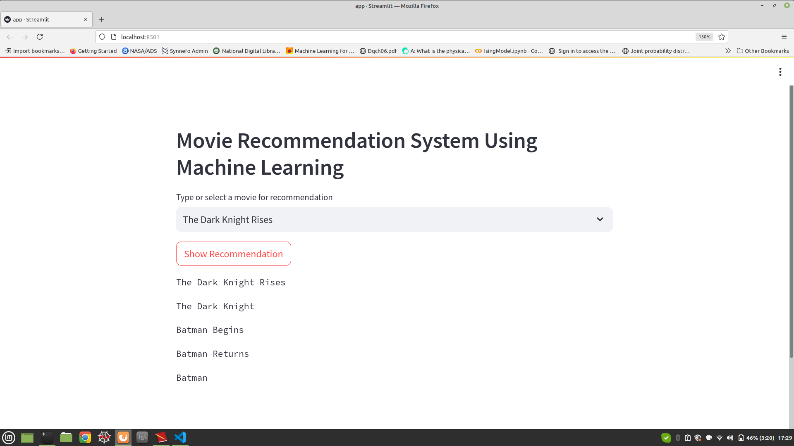
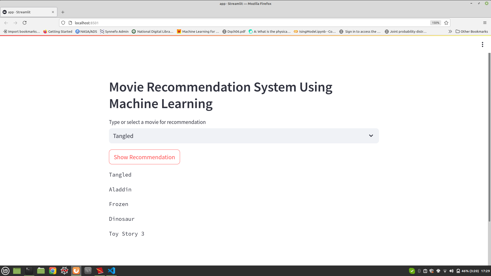
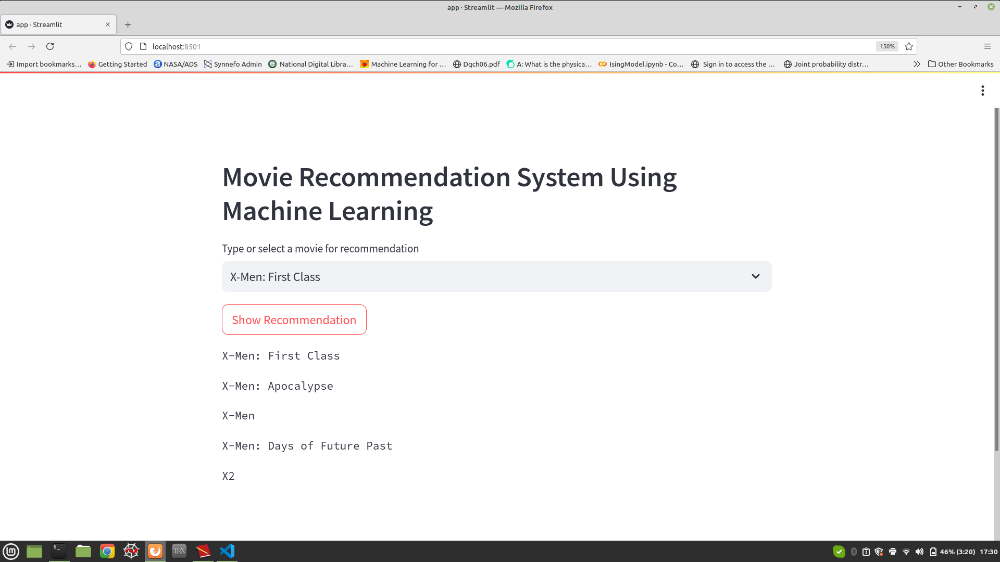

Movie Recommendation System using NLTK library

In this project the TMDB data set (https://www.kaggle.com/datasets/tmdb/tmdb-movie-metadata) has been used to build a movie recommendation system. 

'CountVectorizer' has been used to perform the Text to Vector transformation.

This project is deployed using 'Streamlit'.


### How to run ?
- Download the whole package as zip. Unzip the package. 
- Go to the new folder (ie. the folder created after unzipping) and create a local enviornment. I have used python version 3.8. 
- Now make a directory named 'artifacts'. 
- To install required libraries, do - 
```
pip install -r requirements.txt
```
- Now you can run the notebook file - 'notebooks/movie_reco.ipynb'.
- This will generate the 'movie_data.pkl' which is the input list of names of movies and 'cosine_similarity.pkl' which stores the cosine similarity matrix. 
- These above two files will be needed when we run 'app.py' using 'Streamlit'. 
- To run 'app.py' - 
```
streamlit run app.py

```
This will open a browser at localhost where you will be able to get the recommendations.  

Here is a glimse of the output. 



